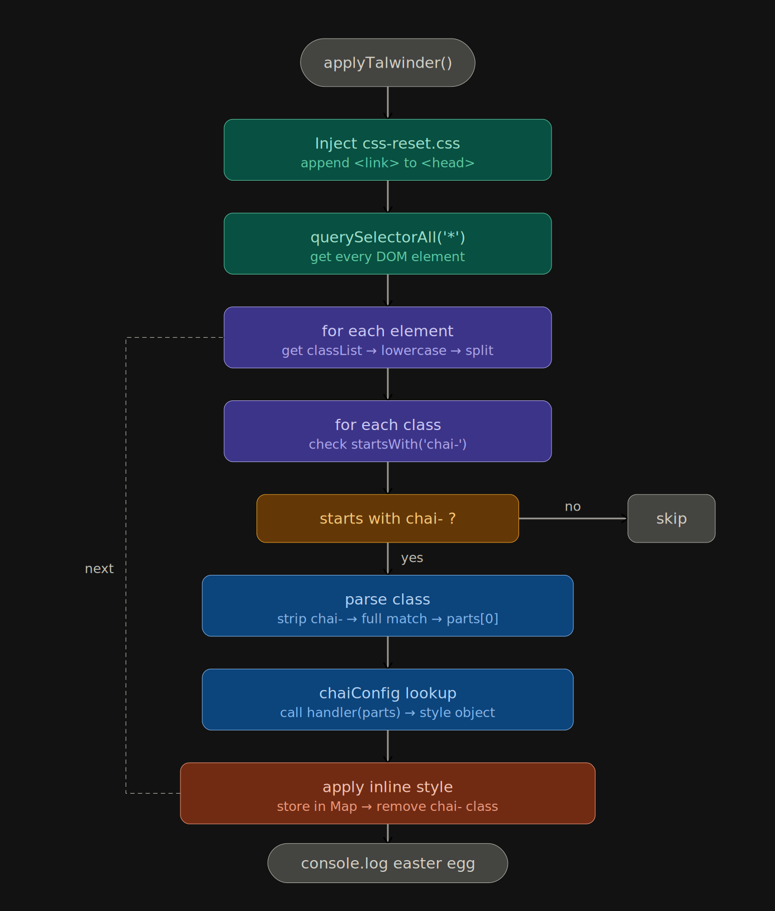

# H5t-Talwinder

H5t-Talwinder is a lightweight utility-first CSS engine written in vanilla JavaScript. Add `chai-*` classes to your HTML and the engine applies the matching styles at runtime using inline styles. No build step and no configuration.

Live demo: <https://talwinder.hudater.dev>



## What this repo contains

### Engine

- `chai-h5t.js`
    - The engine and parser
    - Scans the DOM for `chai-*` classes
    - Maps utilities to style rules and applies them as inline styles
- `css-reset.css`
    - Reset stylesheet used by the engine (it is injected/loaded by the engine when active)

### Demo

- `index.html`
    - Demo page showcasing the utilities
- `style.css`
    - Styling for the demo page only (not part of the utility engine)

## How it works

1. The engine loads the reset stylesheet (when enabled).
2. It walks through elements, reads class names, and looks for the `chai-` prefix.
3. For each supported utility, it applies the corresponding inline style.
4. A toggle is provided on the demo page to enable or remove the applied inline styles.

## Usage

### 1. Include the engine

CDN:

```html
<script src="https://cdn.jsdelivr.net/gh/Hudater/h5t-talwinder@main/chai-h5t.js"></script>
```

Local:

```html
<link rel="stylesheet" href="css-reset.css" />
<script src="chai-h5t.js"></script>
```

Note: In the demo, the engine also dynamically adds the reset stylesheet when toggled on.

### 2. Use `chai-*` classes

```html
<div class="chai-bg-blue-500 chai-text-gray-900 chai-p-4 chai-rounded-md">
    Hello
</div>
```

## Available utilities

The engine supports a set of utility patterns. Exact values depend on what is implemented in `chai-h5t.js`.

### Typography

- Font size
    - `chai-text-xs`, `chai-text-sm`, `chai-text-base`, `chai-text-lg`, `chai-text-xl`, `chai-text-2xl`, `chai-text-3xl`, `chai-text-4xl`
- Font weight
    - `chai-font-light`, `chai-font-normal`, `chai-font-semibold`, `chai-font-bold`
- Text alignment
    - `chai-text-left`, `chai-text-center`, `chai-text-right`, `chai-text-justify`

### Colors

- Background color
    - `chai-bg-{color}-{shade}`
- Text color
    - `chai-text-{color}-{shade}`

Colors provided in the engine:

- `red`, `blue`, `green`, `yellow`, `purple`, `gray`, `orange`

Shades:

- `100` to `900`

Examples:

- `chai-bg-green-200`
- `chai-text-gray-700`

### Spacing

- Padding
    - `chai-p-{n}`, `chai-px-{n}`, `chai-py-{n}`, `chai-pt-{n}`, `chai-pb-{n}`, `chai-pl-{n}`, `chai-pr-{n}`
- Margin
    - `chai-m-{n}`, `chai-mx-{n}`, `chai-my-{n}`, `chai-mt-{n}`, `chai-mb-{n}`, `chai-ml-{n}`, `chai-mr-{n}`

Spacing scale:

- `n` is interpreted by the engine (commonly 1 unit = 4px in the demo)

### Borders and radius

- Borders
    - `chai-border`, `chai-border-1`, `chai-border-2`, `chai-border-4`
- Radius
    - `chai-rounded-sm`, `chai-rounded-md`, `chai-rounded-lg`, `chai-rounded-xl`, `chai-rounded-full`

### Layout

- Display
    - `chai-flex`, `chai-grid`, `chai-hidden`, `chai-inline`, `chai-inline-block`, `chai-block`
- Flex direction and wrap
    - `chai-flex-row`, `chai-flex-col`, `chai-flex-wrap`, `chai-flex-nowrap`
- Alignment
    - `chai-items-start`, `chai-items-center`, `chai-items-end`
- Justification
    - `chai-justify-start`, `chai-justify-center`, `chai-justify-end`, `chai-justify-between`

### Gap and grid columns

- Gap
    - `chai-gap-{n}`
- Grid columns
    - `chai-grid-cols-{n}`

### Width

- Fractions
    - `chai-w-full`, `chai-w-1/2`, `chai-w-1/3`, `chai-w-2/3`, `chai-w-1/4`, `chai-w-3/4`

## Running the demo locally

Open `index.html` in a browser.

If you want a simple local server on Linux:

```bash
cd h5t-talwinder
python3 -m http.server 5173
```

Then visit:

- <http://localhost:5173>

## License

See `LICENSE`.
